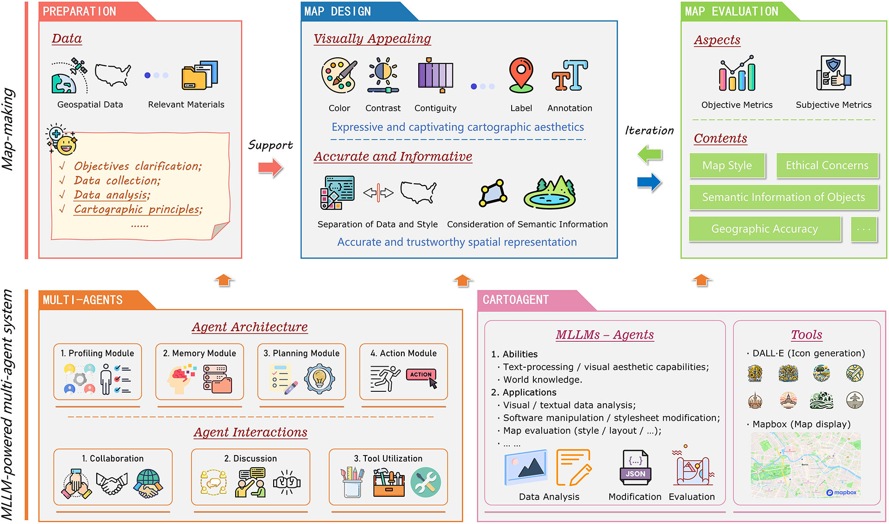
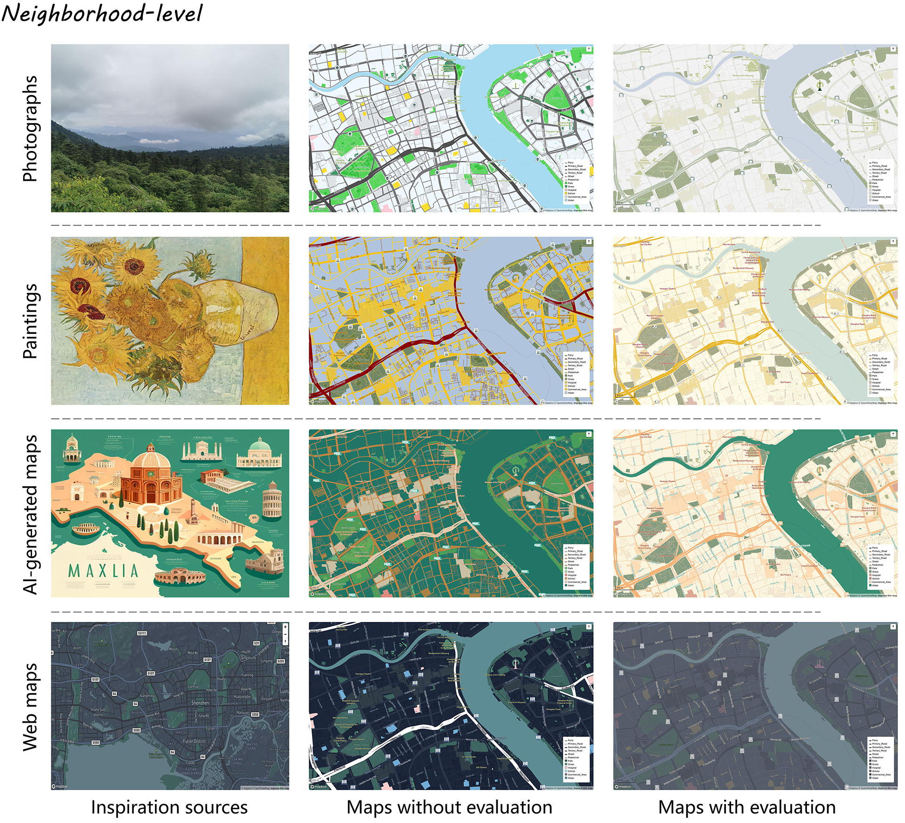
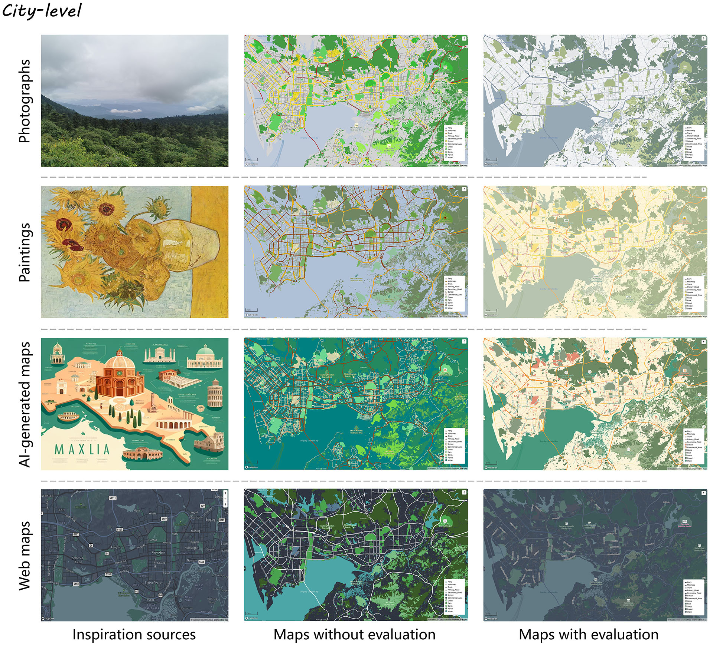
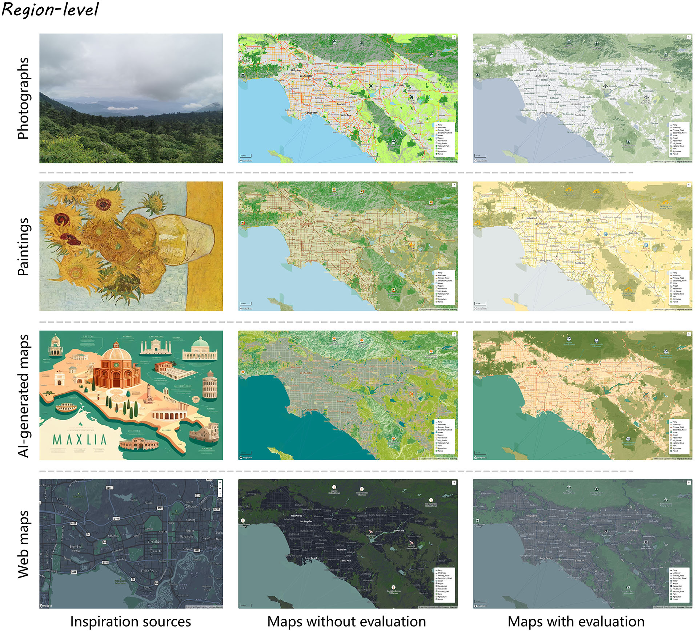

# 🗺️ CartoAgent - Map Style Transfer and Evaluation

Welcome to the official repository for our work **"CartoAgent: a multimodal large language model-powered multi-agent cartographic framework for map style transfer and evaluation"**!

## 🌟 Overview

The rapid development of generative artificial intelligence (GenAI) presents new opportunities to advance the cartographic process. Previous studies have either overlooked the artistic aspects of maps or faced challenges in creating both accurate and informative maps. In this study, we propose a novel multi-agent cartographic framework, CartoAgent, powered by multimodal large language models (MLLMs). Our framework simulates the three stages of the cartographic process: preparation, map design, and evaluation. At each stage, different MLLMs act as agents with distinct roles, collaborating, discussing, and utilizing tools to automatically create maps. By leveraging visual aesthetic capabilities of MLLMs and their world knowledge, CartoAgent generates maps that are both visually appealing and informative. In particular, by separating style from geographic data, our agents focus solely on designing stylesheets without modifying the vector-based data, thereby ensuring geographic accuracy. We apply this framework to a specific task centered on map restyling—namely, map style transfer and evaluation. Through extensive experiments and a human evaluation study, we confirm that the results align with human perceptions and demonstrate the effectiveness of our framework. CartoAgent can be extended to support a variety of cartographic design decisions, informing future integrations of GenAI in cartography.



## 📦 Setup

Clone the repository and install required packages:

```bash
pip install openai
```

## 🛠️ Requirements

| Dependency | Description                               |
| ---------- | ----------------------------------------- |
| Openai     | Access to GPT-4o or similar MLLM endpoint |
| Mapbox     | Mapbox access token and username          |

## 🚀 Usage

To run a map style transfer and evaluation task, use the following command:

```bash
python map_style_transfer.py \
  --api_key <your_openai_api_key> \
  --mapbox_token <your_mapbox_token> \
  --mapbox_username <your_mapbox_username> \
  --inspiration_path ./data/inspiration.png \
  --map_data_path ./data/map_data_shanghai.json
```

This command will:

1. Encode the reference image.
2. Generate a Mapbox-compatible style specification based on the inspiration.
3. Render the map with the new style.
4. Evaluate the result with a reviewer agent.







## 📁 Repository Structure

| Path                            | Description                                                  |
| ------------------------------- | ------------------------------------------------------------ |
| ./data/inspiration.png          | Input image for map style inspiration (e.g., historical map or painting) |
| ./data/map_data_shanghai.json   | Input Mapbox style or vector tile schema                     |
| ./map_style_transfer.py         | Main entry script for style transfer pipeline                |
| ./utils/prompt.py               | Prompt templates for the three agents: appreciator, designer, reviewer |
| ./results/                      | Output folder for styled maps, logs, and evaluation results  |
| ./results/log.txt               | Dialogue history between agents                              |
| ./results/{style_name}_{id}.png | Output styled map image                                      |

## 📌 Future Work

We aim to extend CartoAgent in several directions:

- 🌐 Support for diverse platforms (e.g., QGIS, Google Maps)
- 🧠 Integration with image generation models (e.g., DALL·E) for generative icons

## 📫 Contact

For questions or collaborations, please feel free to:

- Open an Issue
- Or contact the maintainer directly at: chenglongw@stu.pku.edu.cn
